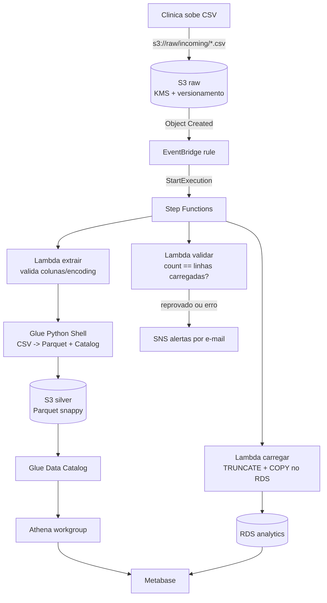

# terraform-aws-metabase

Metabase em ECS Fargate **Spot** (2 tasks, 2 AZs) com RDS PostgreSQL
(perfil dev/test) como application database, atras de um ALB.
Inspirado na estrutura de [elasticscale/terraform-aws-n8n], mas com RDS no
lugar de EFS — o app database compartilhado e o que permite ao Metabase
escalar horizontalmente com seguranca (o n8n nao suporta bem multiplas
replicas; o Metabase sim).

## Arquitetura

### Camada de BI (Metabase)

```
Internet
   |
  ALB (2 AZs, subnets publicas)  <- CIDRs restringiveis
   |
ECS Fargate - 2 tasks Metabase (base=1 on-demand + Spot, subnets publicas, SG so-ALB)
   |
RDS PostgreSQL db.t4g.micro (subnets isoladas, Single-AZ, subnet group em 2 AZs)
   |
Secrets Manager (senha master gerenciada pelo proprio RDS)
```

### Pipeline ETL (raw -> silver -> analytics)



As Lambdas `carregar`/`validar` rodam nas subnets isoladas e alcancam o
Secrets Manager e o S3 por VPC endpoints (Interface + Gateway) — sem NAT.

## Decisoes de custo

| Item | Decisao | Economia | Tradeoff |
|---|---|---|---|
| Fargate Spot parcial | base=1 on-demand + excedente Spot | ~35% vs 2x on-demand | 1 task sempre garantida; a 2a pode sofrer interrupcao Spot |
| Sem NAT Gateway | tasks em subnet publica c/ IP publico + SG restrito | ~USD 45/mes (sa-east-1) | Postura de rede menos conservadora |
| RDS Single-AZ t4g.micro gp3 | perfil dev/test | ~50% vs Multi-AZ | Failover de AZ do banco tem downtime |
| Container Insights off | `disabled` | custo CloudWatch | Menos observabilidade |

Estimativa total: **~USD 30-45/mes** em sa-east-1 (ALB e o maior fixo, ~USD 20).

## Uso

```bash
cp terraform.tfvars.example terraform.tfvars   # ajuste valores
cp backend.hcl.example backend.hcl             # nome do bucket de state

# O bucket de state precisa existir antes do init (nao e gerenciado por esta
# stack). Crie uma vez, com versionamento:
#   aws s3api create-bucket --bucket "$BUCKET" --region sa-east-1 \
#     --create-bucket-configuration LocationConstraint=sa-east-1
#   aws s3api put-bucket-versioning --bucket "$BUCKET" \
#     --versioning-configuration Status=Enabled

# ATENCAO: a key do state esta fixa em "metabase/dev/". Para um segundo
# ambiente (prod), use outra key via -backend-config="key=metabase/prod/terraform.tfstate"
# no init - nunca reutilize o mesmo state para dois ambientes.

terraform init -backend-config=backend.hcl
terraform fmt -check -recursive
terraform validate
terraform plan -out=tfplan
# revise o plan; so entao:
terraform apply tfplan
```

Primeiro boot demora ~2-4 min (JVM + migracoes de schema no RDS).
Acesse `metabase_url` (output) e crie o usuario admin **imediatamente** —
ate la, qualquer pessoa com acesso ao ALB pode fazer o setup.

## Upgrades do Metabase

1. Faca snapshot manual do RDS (`aws rds create-db-snapshot ...`).
2. Altere `metabase_image` para a nova tag **em PR separado**.
3. `plan -out` -> revisao -> `apply`. As migracoes de schema rodam no boot;
   com 2 replicas, o lock de migracao garante que apenas uma executa.
4. Rollback de imagem NAO desfaz migracoes de schema — por isso o snapshot
   do passo 1 e a evidencia/segurança de rollback real.

## Athena / camada silver

O Metabase consulta os Parquet da camada silver via Amazon Athena, usando o
Glue Data Catalog como metastore. Ao contrario de versoes anteriores, o
bucket silver e ARTEFATO INTERNO desta stack: quem escreve nele e o Glue job
do proprio projeto, entao ele e criado e gerenciado aqui.

```
S3 raw (CSV) --[Glue Python Shell job]--> S3 silver (Parquet) + Glue Catalog
                                                       |
IAM Task Role (Metabase) --------------------> Amazon Athena (workgroup dedicado)
                                                       |
                                           S3 resultados (expira em 7 dias)
```

**Sem crawler**: o job registra/atualiza as tabelas direto no Catalog via
awswrangler. Isso elimina o custo por execucao do crawler e o classificador
CSV dele, que falha com separador `;` (comum em sistemas BR). O job e
full-refresh idempotente: rodar de novo substitui, nunca duplica.

**Sem custo de rede adicional**: as tasks ja tem saida HTTPS 443 liberada
(`task_https_out` em `security.tf`), o que cobre Athena, Glue e S3 - nenhuma
mudanca de Security Group ou NAT foi necessaria para o Metabase.

**Conexao no Metabase (driver Athena)**: preencha apenas Region, Workgroup
(output `athena_workgroup_name`) e S3 staging directory (output
`athena_results_s3_uri`); deixe Access key/Secret key em branco — a task
assume a IAM role automaticamente.

**Execucao avulsa do job** (fora do pipeline orientado a eventos):
```bash
aws glue start-job-run --job-name $(terraform output -raw glue_etl_job_name)
```

## Pipeline ETL orientado a eventos

1. Suba um CSV mapeado em `DATASETS` (ex.: `procedures*.csv`) para
   `s3://$(terraform output -raw etl_raw_bucket)/incoming/`.
2. EventBridge dispara a state machine: extrair (validacao) -> Glue
   (silver/Parquet) -> carregar (RDS `analytics`) -> validar (qualidade).
3. Qualquer falha ou reprovacao de qualidade publica no SNS
   (`alert_email` — confirme a subscription apos o primeiro apply).

Para aceitar um dataset novo, adicione a entrada em `lambda/extrair.py`
(colunas obrigatorias) e em `lambda/carregar.py` (schema Postgres).

**Requisito do apply**: o build das Lambdas roda `pip install pg8000` na
maquina local via Python. O executavel e detectado por plataforma (`python`
no Windows, `python3` no Linux/macOS/CI), porque o `python3` do Windows e
apenas um alias da Microsoft Store que falha com exit 9009. Use
`build_python` no tfvars so para apontar outro interpretador (venv, versao
especifica). Requisito: Python 3.x com `pip` no PATH.

## Endurecimento para producao (checklist)

- [ ] `multi_az = true` no RDS (deletion_protection e final snapshot ja sao automaticos com `environment = "prod"`)
- [x] `base = 1` no capacity provider FARGATE (1 task on-demand garantida) — ja implementado
- [x] Deployment circuit breaker com rollback automatico — ja implementado
- [ ] `certificate_arn` + HTTPS, `alb_allowed_cidr_blocks` restrito
- [ ] Subnets privadas + NAT (ou VPC endpoints p/ ECR/Secrets/Logs)
- [ ] Container Insights + alarmes (task count < 2, CPU RDS, storage)
